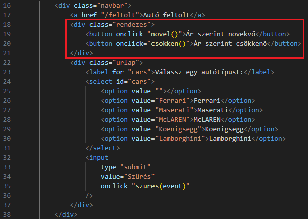

# Express.js + MySQL

1. Töltsük le a gépünkre a **Node.js** legutolsó stabil változatát a saját [Node.js](https://nodejs.org/en) oldalról.
   
2. Hozzunk létre egy mappát **express_mysql** néven a hasonló nevű **GitHub repository**-ból. Nyissuk meg a **Visual Studio Code** segítségével. Nézzük meg a telepített **Node.js** verziószámát a **Git Bash** felületen. A verziószám legalább 18.18.0 legyen!
   
3. Adjuk ki a következő utasítást, amellyel létrehozzuk a szükséges környezetet a gépünkön a szerveroldali alkalmazáshoz (**API**).
   `npm init -y`
   
4. Telepítsük fel a szükséges **npm** csomagokat.
   `npm install dotenv ejs express mysql2`
   
5. Szerkesszük a kapott **package.json** állományt. A **package-lock.json** állományhoz és a **node_modules** mappához ne nyúljunk, csak ha tudjuk mit csinálunk!
   
6. Hozzuk létre a **public** és **views** mappákat, valamint a **.env**, **.gitignore** és **server.js** állományokat.
   
7. Lépjünk be a **public** mappába és ott hozzuk létre a **css**, **images** és **js** mappákat. Ezután a **css** könyvtárba lépve alkossuk meg a **stilus.css** állományt. Majd menjünk vissza az alapmappába!
   
8. Szerkesszük a **.env** és **.gitignore** állományokat.
   
9. **server.js** kezdeti beállítása.
   
10. Índítsuk el a szervert és nézzük az eredményét a böngészőben. Ehhez egyidejű lenyomás a **Git Bash** felületén.
    `ctrl + http://localhost:3500`
    
11. Hozzunk létre **autok** néven egy **MySQL** adatbázist a **localhost phpmyadmin** felületén. Majd építsük ki az összeköttetést az adatbázis és a szerver között. Ehhez alkossunk meg egy **database.js** állományt az alapmappában és szerkesszük.
    
12. Most a **server.js** állomány továbbfejlesztése következik.
    
13. Lépjünk be a **views** mappába és hozzuk létre az **index.ejs**, az **egyedi.ejs** és a **feltolt.ejs** állományokat. Majd menjünk vissza az alapmappába!
    
14. Szerkesszük az **index.ejs** állományt.
    
15. Lehetséges **css** beállítások a **stilus.css** állományban.
    
16. Eddig itt tartunk.
    
17. Hozzuk létre az új autók feltöltésére alkalmas oldalt, azaz szerkesszük a **feltolt.ejs** oldalt.
    
18. Látható, hogy az űrlap adatok kezeléséhez szükségünk lesz egy **autokezeles.js** javascript állományra a **public** mappa **js** almappájában. Hozzuk létre és szerkesszük.
    
19. Mindezek működéséhez a **server.js** állományt is módosítani kell.
    
20. Most foglalkozzunk az **egyedi.ejs** állománnyal. Ezt arra használjuk, hogy a listából kiválasztott autót külön oldalon be tudjuk mutatni. Ehhez először ismét a **server.js**-t kell módosítani.
    
21. Nézzük mi került az **egyedi.ejs** állományba.
    
22. Képileg így néz ki.
    
23. Állítsuk be először a törlési funkciót. Ez törli az adatbázisból az adott autót, ha a **Töröl** gombra (valójában link) kattintunk. Ehhez ismét a **server.js** állományban kell dolgoznunk.
    
24. Most próbáljuk meg módosítani a kijelölt elemet. Ehhez szükségünk lesz egy **modosit.ejs** állományra a **views** mappában.
    
25. Látható, hogy egy **modosit()** függvényt kell létrehoznunk az **autokezeles.js** állományban. Nézzük.
    
26. De, hogy mindez működjön, módosítani kell a **server.js** állományt is. Újra.
    
27. Végül próbálkozzunk meg az autók márka szerinti szűrésével. Ehhez helyezzünk el a weboldalon egy legördülő lista elemet. Nézzük a hozzá tartozó kódrészletet az **index.ejs** állományban. Megjelent egy **if**-es kifejezés is, ami meg fogja jeleníteni az adott autótípus márkáját.
    
28. A **szures()** függvény elég egyszerű.
    
29. És végül a sokadjára átdolgozott **server.js**. Itt a **root-route**-ot dolgoztuk teljesen át.
    

# Adatbázis

1. Az adatbázis felépítéséhez.
   
2. Értékek. A képeket a **public/images** mappába helyezzük el.
   

# Továbbfejlesztések

## Rendezés ár szerint.

1. Ha ár szerint szeretnénk rendezni az oldalunkat, akár márkára történt szűrés után is, akkor az **index.ejs** módosításával kell kezdenünk.
   
2. A szükséges **novel()** és **csokken()** függvényeket az **autokezeles.js** állományban dolgozzuk ki.
   
3. Természetesen a **server.js** szerkesztése sem maradhat ki.
   
4. És az eredmény az egyik márkára szűrés után.
   

## views/partials mappa

1. Hozzunk létre egy **.prettierignore** nevű állományt, ahová azokat a mappákat, állományokat írjuk, amelyekre nem szeretnénk, ha hatna a **Prettier** extension.
   
2. A **views** mappában hozzunk létre egy **partials** nevű mappát. Lépjünk be és szúrjunk be két állományt **header_01.ejs** és **header_01.ejs** néven. Ezekben fogjuk a későbbiekben szerkeszteni az **ejs** állományok fejrészét. Létre lehet még hozni egy közös **footer.ejs** állományt is, de ez nem kötelező.
   
3. A **.prettierignore** állományba írjuk be a következő sort. Tehát letiltottuk a **Prettier** használatát ebben a mappában.
   
4. Másoljuk át a **headers_01.ejs** állományba az **index.ejs** első néhány sorát.
   
5. Tegyük meg ugyanezt az utolsó néhány sorával a **footer.ejs**-be.
   
6. Szerkesszük az **index.ejs** állományt. Hasonlóan tegyünk a **feltolt.ejs** állománnyal.
   
7. A **header_02.ejs** csak minimálisan különbözik a **header_01.ejs**-től, de viszont ott lényegesen. Ezt az **egyedi.ejs** és **modosit.ejs** állományokba kell berakni.
   
8. Utolsó feladatként a **server.js** állományban, minden **render** metódusban helyezzünk el **title** tulajdonságot (property).
   
